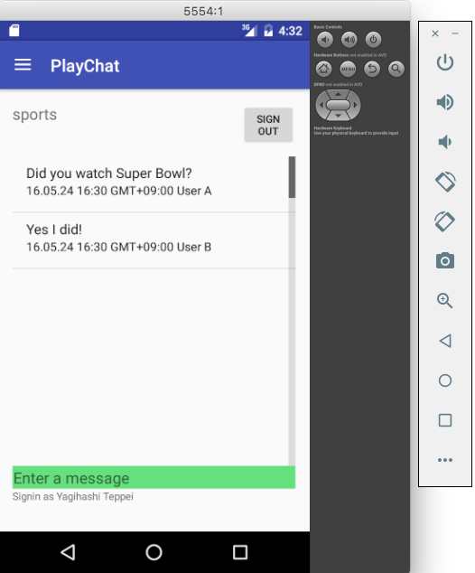

# Build a mobile app using Firebase and App Engine flexible environment

This tutorial contains the Android client sample code for the [Build a Mobile
App Using Firebase and App Engine Flexible
Environment](https://cloud.google.com/solutions/mobile/mobile-firebase-app-engine-flexible)
solution. You can find the sample code for the backend in the
[firebase-appengine-backend](https://github.com/GoogleCloudPlatform/java-docs-samples/tree/master/flexible/mobile-backend)
repository.

## Build requirements

- Sign up for [Firebase](https://firebase.google.com/) and create a new project
  in the [Firebase console](https://console.firebase.google.com/).
- Deploy your backend according to the instructions in the
  [firebase-appengine-backend](https://github.com/GoogleCloudPlatform/java-docs-samples/tree/master/flexible/mobile-backend)
  repository.

> **Note**: Firebase is a Google product, independent from Google Cloud
> Platform.

Build and test environment:

- Android Studio 3.1.2 from the stable channel.
- Android 8.1 (API Level 27) emulator.

## Configuration

1. Sign in to the [Firebase console](https://console.firebase.google.com) and
   select your backend project.
1. In the **Develop** section, select **Authentication**.
1. In the **Authentication** page, select **Sign-in Method**.
1. Select and enable the **Google** sign-in provider.
1. [Get your development environment SHA-1
   fingerprints](https://developers.google.com/android/guides/client-auth).
1. Provide the following information in your Firebase project settings:
   - **App nickname**: PlayChat
   - **Package name**: com.google.cloud.solutions.flexenv
   - **SHA certificate fingerprints**: Your development environment SHA-1
     fingerprints from the previous step.
1. Download the `google-services.json` file to the root directory of the `app`
   module in your Android project.

## Launch and test

1. Start your emulator and run the app.
1. Sign in with a Google account.
1. Select a channel from top-left menu and enter messages.

The following screenshot shows messages displayed in the app:

This sample supports speech messages that are automatically translated to the
device language. For more information, see [Enable speech translation with
Machine Learning technologies on Google Cloud Platform](SPEECH-TRANSLATION.md).

## License

Copyright 2018 Google LLC. All Rights Reserved.

Licensed under the Apache License, Version 2.0 (the "License"); you may not use
this file except in compliance with the License. You may obtain a copy of the
License at http://www.apache.org/licenses/LICENSE-2.0 Unless required by
applicable law or agreed to in writing, software distributed under the License
is distributed on an "AS-IS" BASIS, WITHOUT WARRANTIES OR CONDITIONS OF ANY
KIND, either express or implied.  See the License for the specific language
governing permissions and limitations under the License.

This is not an official Google product.
