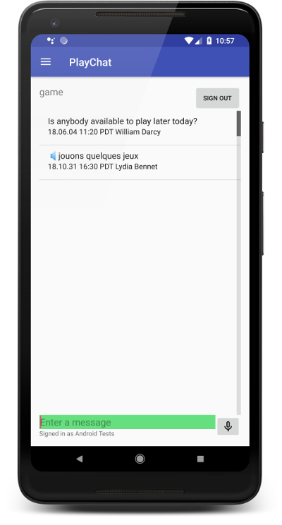

# Enable speech translation with Machine Learning technologies on Google Cloud Platform

The PlayChat sample supports speech messages that are automatically translated
to different languages by a microservice on Google Cloud Platform (GCP).

The microservice is implemented as a [Google Cloud Function][1] that uses the
[Speech-to-Text][2], [Translation][3], and [Text-to-Speech][4] APIs to process
the audio messages. The translated messages are stored in a bucket on [Google
Cloud Storage][5] where the PlayChat app can retrieve them. The microservice is
available in the [Speech-to-Speech Translation Sample][6].

The following screenshot shows the PlayChat sample with a message translated to
French.

## Configuring speech translation

1. Configure the PlayChat sample following the instructions on the
   [README](README.md) file.
1. Deploy the [Speech-to-Speech Translation Sample][6] to your GCP project.
1. Update the value of the `speechToSpeechEndpoint` field in the
   [speech_translation.xml][7] file with the URL of the function deployed in the
   previous step.
1. Make sure that your user account has read permissions to the bucket where the
   microservice stores the translated audio messages. For more information, see
   [Setting bucket permissions][8] in the Google Cloud Storage documentation.

## Launch and test

1. Start your emulator and run the app.
1. Sign in with a Google account.
1. Tap the microphone icon and record a short voice message in the language of
   your device. The microservice supports English, Spanish, and French by
   default. However, you can configure other languages.
1. Change the default language on your device settings. The PlayChat app
   displays the message on the new language.
1. Tap the translated message to listen to it in the language of the device.

## License

Copyright 2018 Google LLC. All Rights Reserved.

Licensed under the Apache License, Version 2.0 (the "License"); you may not use
this file except in compliance with the License. You may obtain a copy of the
License at http://www.apache.org/licenses/LICENSE-2.0 Unless required by
applicable law or agreed to in writing, software distributed under the License
is distributed on an "AS-IS" BASIS, WITHOUT WARRANTIES OR CONDITIONS OF ANY
KIND, either express or implied.  See the License for the specific language
governing permissions and limitations under the License.

This is not an official Google product.

[1]: https://cloud.google.com/functions/
[2]: https://cloud.google.com/speech-to-text/
[3]: https://cloud.google.com/translate/
[4]: https://cloud.google.com/text-to-speech/
[5]: https://cloud.google.com/storage/
[6]: https://github.com/GoogleCloudPlatform/nodejs-docs-samples/tree/master/functions/speech-to-speech
[7]: https://github.com/GoogleCloudPlatform/android-docs-samples/blob/master/firebase-android-client/app/src/main/res/values/speech_translation.xml
[8]: https://cloud.google.com/storage/docs/cloud-console#_bucketpermission
