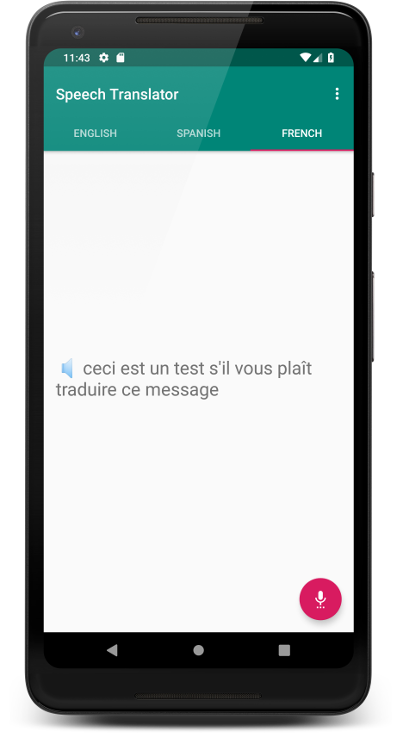

# Speech Translation Sample

The Speech Translation sample allows users to record a short audio message using
the microphone on the device. The sample uses a microservice that translates the
audio to other languages and returns the translated message in text and audio
formats. The sample displays the translated text and plays the corresponding
audio when users tap the message. The following screenshot shows a translated
message on the device:

The microservice is implemented as a [Google Cloud Function][1] that uses the
[Speech-to-Text][2], [Translation][3], and [Text-to-Speech][4] APIs to process
the audio messages. The translated messages are stored in a bucket on [Google
Cloud Storage][5] where the PlayChat app can retrieve them. The microservice is
available in the [Speech-to-Speech Translation Sample][6].

## Configuring the sample

1. Create an OAuth client ID credentials in your GCP project for your Android
   project. Take note of the client ID generated for the credentials. For more
   information, see [Setting up OAuth 2.0][9].
1. Follow the instructions in the [Speech-to-Speech Translation Sample][6] to
   deploy the microservice to your GCP project.
1. Update the following fields in the [`speech_translation.xml`][7] file:
   1. Update the `speechToSpeechEndpoint` field with the URL of the function
   deployed in the previous step.
   1. Update the `gcpClientID` field with the value of the client ID obtained in
      step 1.
1. Enable read permissions for your user accounts to the bucket where the
   microservice stores the translated audio messages. For more information, see
   [Setting bucket permissions][8] in the Google Cloud Storage documentation.

## Launch and test

1. Start your emulator and run the app.
1. Sign in with a Google account.
1. Tap the microphone icon and record a short voice message in the language of
   your device. The sample app displays the text message on screen.
1. Tap the text to play the audio version of the message.
1. Swipe right or left to see or listen to the message in different languages.

## License

Copyright 2018 Google LLC. All Rights Reserved.

Licensed under the Apache License, Version 2.0 (the "License"); you may not use
this file except in compliance with the License. You may obtain a copy of the
License at http://www.apache.org/licenses/LICENSE-2.0 Unless required by
applicable law or agreed to in writing, software distributed under the License
is distributed on an "AS-IS" BASIS, WITHOUT WARRANTIES OR CONDITIONS OF ANY
KIND, either express or implied.  See the License for the specific language
governing permissions and limitations under the License.

This is not an official Google product.

[1]: https://cloud.google.com/functions/
[2]: https://cloud.google.com/speech-to-text/
[3]: https://cloud.google.com/translate/
[4]: https://cloud.google.com/text-to-speech/
[5]: https://cloud.google.com/storage/
[6]: https://github.com/GoogleCloudPlatform/nodejs-docs-samples/tree/master/functions/speech-to-speech
[7]: https://github.com/GoogleCloudPlatform/android-docs-samples/blob/master/app/src/main/res/values/speech_translation.xml
[8]: https://cloud.google.com/storage/docs/cloud-console#_bucketpermission
[9]: https://support.google.com/cloud/answer/6158849?hl=en#installedapplications&android
